# 📋 EVALUACIÓN TÉCNICA - SISTEMA DE MONITOREO Y AUTOMATIZACIÓN DE TANQUE DE AGUA

**Fecha de Auditoría:** 9 de mayo de 2026  
**Tipo de Evaluación:** Auditoría de Arquitectura de Software  
**Nivel de Detalle:** Profesional/Académico  
**Lenguaje:** Java  
**Frameworks/Librerías:** Arduino (jSerialComm)

---

## 1. DESCRIPCIÓN GENERAL DEL SISTEMA

### 1.1 Objetivo del Sistema

El sistema **Water Tank** tiene como objetivo proporcionar una solución integral de **automatización y monitoreo remoto de tanques de agua**. La arquitectura permite:

- **Captura de datos** desde sensores físicos (nivel de agua, temperatura) conectados a Arduino
- **Procesamiento automático** de eventos mediante un sistema de suscriptores
- **Control automático** de bomba mediante lógica de umbralización
- **Gestión de usuarios** con autenticación, autorización y auditoría
- **Interfaz de usuario** mediante consola interactiva
- **Persistencia de logs** para trazabilidad e histórico de eventos

### 1.2 Flujo General de Funcionamiento

```
Arduino → Serial → ArduinoSerial → WaterLevelSensor 
                                        ↓
                                  EventHandler
                                        ↓
                    [EventListener: WaterLevelManager]
                                        ↓
                    [Lógica Automática de Bomba]
                                        ↓
                            IPump → Pump → Arduino LED
                                        ↓
                            RepositoryLog (Auditoría)
```

El flujo es **orientado a eventos**:
1. Arduino envía datos de distancia/temperatura por puerto serial
2. `ArduinoSerial` recibe la lectura y actualiza el `WaterLevelSensor`
3. Cuando el sensor se actualiza, invoca `handleSensor()`
4. Esto emite un evento a través del `EventHandler`
5. Los **listeners suscritos** (como `WaterLevelManager`) reaccionan al evento
6. La lógica de automatización decide si encender/apagar la bomba
7. Todas las acciones se registran en el repositorio de logs

### 1.3 Comunicación entre Java y Arduino

**Tecnología:** jSerialComm (librería multiplataforma para comunicación serial)

**Clase responsable:** `ArduinoSerial.java`

- **Inicialización:** Configura puerto COM, baudrate (9600), y timeout del scanner
- **Lectura continua:** Ejecuta en un thread separado (`hiloEscucha`) para no bloquear la UI
- **Parsing de datos:** Convierte strings recibidos a valores float
- **Manejo de errores:** Captura `NumberFormatException` para datos corruptos
- **Escritura de comandos:** `enviarComando()` envía "1" o "0" para controlar el LED/relé

### 1.4 Gestión de Sensores

Dos tipos de sensores heredan de la clase abstracta `Sensor`:

**WaterLevelSensor:**
- Almacena la distancia en cm (medida por sensor ultrasónico en Arduino)
- Al actualizar via `setWaterLevel()`, invoca `handleSensor()`
- Emite un evento de tipo `WaterLevelEvent`

**TemperatureSensor:**
- Almacena la temperatura (preparado para sensor DHT o similar)
- Mismo patrón de emisión de eventos
- Tipo de evento: `TemperatureEvent`

Ambos heredan el campo `EventHandler` y la lógica de activación (`isActive`).

### 1.5 Gestión de Usuarios

**Flujo de autenticación:**

```
LoginCommand → Authenticator 
    ↓
AuthenticationService (verifica usuario + contraseña)
    ↓
UserRepository (búsqueda en repositorio)
    ↓
PasswordHasher (verificación SHA-256)
```

**Persistencia de usuarios:** `InMemoryUserRepository`
- Carga dos usuarios por defecto: ADMIN y USER (ambos con contraseña "123")
- Implementa `UserRepository` (patrón Repository)
- Utiliza mapa interno `Map<UUID, User>`

**Seguridad:** 
- Hash SHA-256 + Base64 (sin salt en la versión actual)
- Verificación en tiempo de login
- Objeto `Credential` encapsula hash, salt y fecha de último cambio

### 1.6 Control de Bomba

**Interfaz:** `IPump` (contrato de control)

**Implementación:** `Pump.java`
- Comunica con Arduino mediante `ArduinoSerial`
- Métodos: `turnOn()`, `turnOff()`, `getStatus()`
- Estado interno: `isActive`
- Envía comandos "1" (encender) o "0" (apagar)

**Automatización:** `WaterLevelManager`
- Implementa lógica de bombeo automático
- Umbral bajo (10%): activa la bomba automáticamente
- Umbral alto (90%): desactiva la bomba por seguridad
- Reacciona a eventos del sensor en tiempo real

### 1.7 Registro de Eventos y Logs

**Interfaz:** `RepositoryLog`

**Implementación:** `FileLogRepository`
- Escribe logs a archivo `./historial_tanque.txt`
- Cada entrada incluye timestamp en formato `yyyy-MM-dd HH:mm:ss`
- Categorías de logs: `[AUTH]`, `[ACTION]`, `[AUTO]`, `[SEGURIDAD]`
- Manejo de excepciones para errores de I/O

**Auditoría de eventos:**
- Loguea todos los logins
- Registra acciones manuales del usuario (prender/apagar bomba)
- Documenta automatismos (encendidos por nivel bajo)
- Documenta eventos de seguridad (apagado por nivel alto)

---

## 2. ANÁLISIS DE LA ARQUITECTURA

### 2.1 Responsabilidad de Cada Paquete

#### **2.1.1 Paquete: `infrastructure.hardware`**

**Responsabilidad:** Comunicación de infrastructure.hardware a software

**Contenido:**
- `ArduinoSerial.java` - Única clase en este paquete

**Detalle de Responsabilidades:**
| Responsabilidad | Descripción |
|---|---|
| Establecer conexión serial | Abre puerto COM y configura parámetros (baudrate, timeout) |
| Lectura continua de datos | Thread que lee líneas del puerto serial |
| Conversión de datos | Parsea strings a valores numéricos (float) |
| Envío de comandos | Traduce acciones a comandos que Arduino entiende (0/1) |
| Manejo de errores de comunicación | NumberFormatException para datos corruptos |

**Cohesión:** ✅ **MUY ALTA**
- Todas las responsabilidades están directamente relacionadas con comunicación serial
- No existe derramamiento de alógica de negocio

**Acoplamiento:**
- ❌ **Acoplamiento directo** con `WaterLevelSensor` (recibe el sensor como constructor parameter)
- Consecuencia: Si cambiamos el tipo de sensor, debe cambiar `ArduinoSerial`

---

#### **2.1.2 Paquete: `domain`**

**Responsabilidad:** Entidades, valores y contratos del dominio de negocio

**Contenido:**
- Entidades: `User`, `Credential`, `Event`, `Sensor`, `WaterLevelSensor`, `TemperatureSensor`, `WaterTank`, `Alarm`
- Interfaces: `IPump`, `IWaterSystemStatus`, `EventListener`
- Enumeraciones: `RoleType`, `SensorTypeEvent`
- Sistema de eventos: `EventHandler`

**Desglose por Tipo:**

| Clase | Responsabilidad |
|---|---|
| `User` | Entidad de seguridad: id, username, role, activo, credenciales |
| `Credential` | Encapsula hash, salt y fecha de cambio de contraseña |
| `Sensor` | Clase abstracta base para sensores |
| `WaterLevelSensor` | Almacena distancia, emite eventos de cambio |
| `TemperatureSensor` | Almacena temperatura, emite eventos de cambio |
| `WaterTank` | Calcula porcentaje basado en altura total y distancia |
| `Event` | Captura de evento: id, tipo, detalles, timestamp |
| `EventHandler` | Patrón Observer: suscriptores y emisión de eventos |
| `IPump` | Contrato de bomba: encender, apagar, estado |
| `IWaterSystemStatus` | Contrato para UI: lectura de estado del sistema |
| `RoleType` | Enum: ADMIN, USER |
| `SensorTypeEvent` | Enum: TemperatureEvent, WaterLevelEvent, NullEvent |
| `Alarm` | Entidad de alarma: estado y volumen |

**Cohesión:** ✅ **ALTA**
- Todas las clases representan conceptos del dominio de agua
- Cada clase tiene responsabilidad única y clara
- No hay lógica de aplicación aquí

**Acoplamiento:**
- ✅ **BAJO** - Las entidades no dependen unas de otras innecesariamente
- Las interfaces (`IPump`, `IWaterSystemStatus`) están bien separadas
- `EventHandler` es un componente cohesivo independiente

---

#### **2.1.3 Paquete: `Repository`**

**Responsabilidad:** Abstracción de acceso a datos y persistencia

**Contenido:**
- `UserRepository` - Interfaz (contrato)
- `InMemoryUserRepository` - Implementación en memoria
- `RepositoryLog` - Interfaz para logs
- `FileLogRepository` - Implementación con archivo

**Patrón Implementado:** Repository Pattern

**Desglose de Responsabilidades:**

| Clase | Responsabilidad |
|---|---|
| `UserRepository` | Contrato: save, findByUserName, findById |
| `InMemoryUserRepository` | Persistencia en memoria con HashMap |
| `RepositoryLog` | Contrato: saveLog |
| `FileLogRepository` | Persistencia en archivo con timestamp |

**Cohesión:** ✅ **ALTA**
- Cada repositorio maneja un tipo de entidad
- Las responsabilidades están bien separadas

**Acoplamiento:**
- ⚠️ **MODERADO** - `InMemoryUserRepository` inicializa datos con `SimplePasswordHasher`
- Debería inyectarse en lugar de instanciarse dentro del repositorio
- ❌ **Acoplamiento con domain** es apropiado (debe trabajar con `User`, `Credential`)

---

#### **2.1.4 Paquete: `domain.service`**

**Responsabilidad:** Lógica de aplicación, casos de uso, coordinación

**Contenido:** Múltiples clases (30+ clases)

**Agrupación por Concern:**

**A) Autenticación y Autorización:**
| Clase | Responsabilidad |
|---|---|
| `AuthenticationService` | Valida usuario + contraseña contra repositorio |
| `Authenticator` | Orquesta autenticación y autorización, mantiene sesión actual |
| `AuthorizationService` | Verifica permisos por rol |
| `PasswordHasher` (interfaz) | Contrato de hash de contraseñas |
| `SimplePasswordHasher` | Implementación SHA-256 |
| `LoginCommand` | Comando de UI que invoca login |

**B) Gestión de Contexto:**
| Clase | Responsabilidad |
|---|---|
| `AppContext` | Repositorio de servicios globales (auth, handler, logger) |
| `CommandHandler` | Dispatcher de comandos, registro de comandos |

**C) Patrón Command:**
| Clase | Responsabilidad |
|---|---|
| `Command` (interfaz) | Contrato: execute(context, arg) |
| `LoginCommand` | Implementa login interactivo |
| `PumpOnCommand` | Implementa encendido de bomba |
| `PumpOffCommand` | Implementa apagado de bomba |
| `ViewLevelCommand` | Implementa lectura de estado |
| `ViewLogsCommand` | Implementa visualización de logs |

**D) Lógica de Sensores y Automatización:**
| Clase | Responsabilidad |
|---|---|
| `SensorLevelManager` | Clase base: gestiona min/max level |
| `WaterLevelManager` | Extiende SensorLevelManager, implementa EventListener, lógica de bombeo automático |
| `TemperatureManager` | Gestión de temperatura (similar a SensorLevelManager) |
| `Pump` | Implementa IPump, controla bomba física |

**Cohesión:** ⚠️ **MEDIA-ALTA**
- Bien separada por concern
- Pero hay múltiples responsabilidades agrupadas

**Acoplamiento:**
- ❌ **ALTO dentro de domain.service**
  - `LoginCommand` instancia `Scanner` (I/O acoplado)
  - `WaterLevelManager` hereda de `SensorLevelManager` (herencia innecesaria)
  - `Pump` acoplado a `ArduinoSerial`
- ✅ **BAJO hacia otros paquetes**
  - Depende de interfaces de domain (`IPump`, `IWaterSystemStatus`)
  - Depende de interfaces de Repository (`UserRepository`, `RepositoryLog`)

---

#### **2.1.5 Paquete: `Main`**

**Responsabilidad:** Orchestración e inyección de dependencias

**Contenido:**
- `Main.java` - Bootstrap de la aplicación
- `Alarm.java` - Entidad de alarma (¿Debería estar en domain?)

**Detalle:**

`Main.java` es un **bootstrap/composition root** que:

1. Instancia repositorios
2. Instancia servicios de seguridad
3. Instancia sensores
4. Instancia infrastructure.hardware (ArduinoSerial)
5. Instancia actuadores (Pump)
6. Instancia managers de lógica
7. Registra comandos
8. Inicia la UI

**Observación:** Este es el lugar exacto donde debería ocurrir la **inyección de dependencias** de forma explícita.

---

#### **2.1.6 Paquete: `presentation`**

**Responsabilidad:** Presentación e interacción con usuario

**Contenido:**
- `Console.java` - Única clase en este paquete

**Responsabilidades:**
| Responsabilidad | Descripción |
|---|---|
| Renderización de UI | Menús, dashboard, banners en ANSI |
| Captura de entrada | Scanner para input del usuario |
| Resolución de input | Convierte números de menú a comandos |
| Logística de sesión | Muestra opciones según usuario logueado |
| Control de flujo | Loop principal, pausa, etc. |

**Cohesión:** ✅ **ALTA**
- Todo está relacionado con UI de consola

**Acoplamiento:** ⚠️ **NOTABLE**
- ✅ Depende de interfaces: `IWaterSystemStatus`, `CommandHandler`, `AppContext`
- ✅ Usa inyección de dependencias en constructor
- ⚠️ Crea su propio `Scanner` internamente (I/O acoplado)
- ⚠️ Conoce la estructura de `AppContext`, `Authenticator`, `User`

---

### 2.2 Análisis Global de Separación de Capas

#### **2.2.1 Estructura de Capas Identificadas:**

```
┌─────────────────────────────────────────┐
│          CAPA DE PRESENTACIÓN            │
│         (presentation/Console.java)               │
└─────────────────────────────────────────┘
                    ↓
┌─────────────────────────────────────────┐
│       CAPA DE APLICACIÓN (domain.service)     │
│  - Command Pattern                      │
│  - Managers de lógica                   │
│  - Autenticación                        │
└─────────────────────────────────────────┘
                    ↓
┌─────────────────────────────────────────┐
│     CAPA DE DOMINIO (domain)            │
│  - Entidades                            │
│  - Interfaces de contrato               │
│  - Lógica de dominio                    │
└─────────────────────────────────────────┘
                    ↓
┌─────────────────────────────────────────┐
│    CAPA DE PERSISTENCIA (Repository)    │
│  - UserRepository                       │
│  - RepositoryLog                        │
└─────────────────────────────────────────┘
                    ↓
┌─────────────────────────────────────────┐
│   CAPA DE HARDWARE (infrastructure.hardware)        │
│  - ArduinoSerial                        │
└─────────────────────────────────────────┘
```

#### **2.2.2 Análisis de Acoplamiento Console ↔ Lógica del Tanque:**

**Inyección de Dependencias en Console:**

```java
public Console(CommandHandler commandHandler, AppContext context, IWaterSystemStatus status)
```

**Dependencias recibidas:**
- `CommandHandler` - Dispatcher tipado ✅
- `AppContext` - Agregador de servicios ⚠️
- `IWaterSystemStatus` - Interfaz de dominio ✅

**Puntos de Acoplamiento Detectados:**

| Punto | Tipo | Severidad | Detalle |
|---|---|---|---|
| `context.getAuth()` | Conocimiento de estructura | MEDIA | Console accede a Authenticator a través de AppContext |
| `context.getAuth().getCurrentUser()` | Acceso a estado de sesión | MEDIA | Console lee directamente el usuario actual |
| `status.getCurrentDistance()` | Interfaz bien conocida | BAJA | Abstracción apropiada |
| `scanner = new Scanner()` | I/O acoplado | BAJA | Instancia propia, pero podría inyectarse |
| Menú ADMIN_CMDS[] | Lógica de comandos hardcodeada | MEDIA | Los comandos están hardcodeados vs dinámicos |

**Evaluación del Acoplamiento:**

```
Console → AppContext
           ├─→ Authenticator
           ├─→ EventHandler
           └─→ RepositoryLog

Console → CommandHandler
           └─→ Map<String, Command>

Console → IWaterSystemStatus (WaterLevelManager)
           └─→ Interfaz → OK
```

**Resultado:** ⚠️ **Acoplamiento MODERADO-ALTO**

- Console **conoce demasiada estructura interna** de AppContext
- Console hace **drilling** para obtener datos (getAuth().getCurrentUser())
- Sería mejor que AppContext expusiera métodos de fachada

---

### 2.3 Análisis de Cohesión

**Cohesión por Paquete:**

| Paquete | Nivel | Justificación |
|---|---|---|
| infrastructure.hardware | ALTA | Solo responsabilidades de comunicación serial |
| domain | ALTA | Solo conceptos del dominio de negocio |
| Repository | ALTA | Solo acceso a datos y persistencia |
| domain.service | MEDIA-ALTA | Múltiples concerns: auth, comandos, managers, contexto |
| Main | BAJA | Solo bootstrap, no es lógica reutilizable |
| presentation | ALTA | Solo presentación e I/O |

**Cohesión General:** ✅ **ALTA**
- Los paquetes tienen propósitos claros
- Los concerns están separados

---

### 2.4 Análisis de Flujo de Dependencias

**Dependencias Permitidas (Correctas):**

```
presentation → domain.service ✅
presentation → domain (interfaces) ✅
domain.service → domain ✅
domain.service → Repository ✅
Repository → domain ✅
infrastructure.hardware → domain ✅
Main → Todos (bootstrap) ✅
```

**Dependencias Problemáticas:**

```
❌ infrastructure.hardware → domain.service (No debería)
   Actual: ArduinoSerial no tiene dependencias de domain.service (OK)

❌ domain → domain.service (No debería)
   Actual: domain no tiene dependencias de domain.service (OK)

❌ Repository → domain.service (No debería)
   Actual: InMemoryUserRepository → SimplePasswordHasher (¿en domain.service?)
   PROBLEMA: SimplePasswordHasher está en domain.service pero es una utilidad
```

**Conclusión:** ✅ **Las dependencias fluyen hacia abajo (correcto)**

---

### 2.5 Uso de Interfaces

**Interfaces Definidas:**

| Interfaz | Ubicación | Propósito | ¿Bien Usada? |
|---|---|---|---|
| `IPump` | domain | Contrato de bomba | ✅ SÍ - Pump la implementa, Commands la usan |
| `IWaterSystemStatus` | domain | Lectura de estado | ✅ SÍ - WaterLevelManager la implementa, Console la usa |
| `EventListener` | domain | Observer implícito | ✅ SÍ - WaterLevelManager la implementa |
| `UserRepository` | Repository | CRUD de usuarios | ✅ SÍ - bien implementada |
| `RepositoryLog` | Repository | Persistencia de logs | ✅ SÍ - bien implementada |
| `PasswordHasher` | domain.service | Hash de contraseñas | ✅ SÍ - SimplePasswordHasher la implementa |
| `Command` | domain.service | Patrón Command | ✅ SÍ - Múltiples comandos la implementan |

**Evaluación:** ✅ **Las interfaces están bien usadas**
- Abstractan correctamente los contratos
- Permiten polimorfismo
- Facilitan testing

---

### 2.6 Escalabilidad y Extensibilidad de la Arquitectura

#### **Puntos Fuertes:**

1. **Patrón Command bien implementado**
   - Nuevos comandos → Crear class implementando `Command`
   - Registrar en `CommandHandler`

2. **Patrón Repository permite cambios de persistencia**
   - Para cambiar a base de datos: nueva implementación de `UserRepository`

3. **Sistema de eventos permite nuevos listeners**
   - Nuevos comportamientos → Crear class implementando `EventListener`

4. **Interfaz `IPump`**
   - Para simular bomba → Mock
   - Para controlar motor distinto → Nueva implementación

#### **Puntos Débiles:**

1. ❌ **Comandos hardcodeados en Console**
   - Arrays ADMIN_CMDS y GUEST_CMDS no son dinámicos
   - Si agrega comando, debe modificar Console

2. ❌ **AppContext es un contenedor genérico**
   - No permite crecer de forma ordenada
   - Si hay 20 servicios, AppContext crece sin control

3. ❌ **WaterLevelManager y TemperatureManager duplican código**
   - SensorLevelManager es una clase base, no una interfaz

4. ❌ **Falta desacoplamiento de I/O**
   - LoginCommand instancia Scanner
   - ArduinoSerial instancia Scanner
   - No hay abstracción de I/O

---

## 3. CONCLUSIÓN TÉCNICA - CALIDAD DE SEPARACIÓN DE CAPAS

### 3.1 Evaluación Global

| Aspecto | Calificación | Comentario |
|---|---|---|
| **Separación de Capas** | ✅ BUENA | Capas claramente identificadas: UI → domain.service → domain → Repository → Hardware |
| **Responsabilidad por Paquete** | ✅ BUENA | Cada paquete tiene propósito claro |
| **Cohesión** | ✅ ALTA | No hay mezcla de concerns indebida |
| **Acoplamiento** | ⚠️ MODERADO | Console acoplada a AppContext; ArduinoSerial acoplada a WaterLevelSensor |
| **Flujo de Dependencias** | ✅ CORRECTO | Las dependencias fluyen hacia capas inferiores |
| **Uso de Interfaces** | ✅ BIEN USADO | Las interfaces abstractan correctamente |
| **Escalabilidad** | ⚠️ MODERADA | Comando pattern es escalable, pero UI debe mejorar |
| **Mantenibilidad** | ✅ BUENA | Código está organizado, es fácil ubicar responsabilidades |

### 3.2 Problemas Arquitectónicos Detectados

**CRÍTICOS:**

1. **AppContext como bolsa de servicios** (Anti-patrón Service Locator)
   - Console hace drilling: `context.getAuth().getCurrentUser()`
   - Debería haber métodos de fachada en AppContext

2. **Acoplamiento ArduinoSerial → WaterLevelSensor**
   - ArduinoSerial recibe el sensor específico
   - ¿Qué pasa si queremos múltiples sensores?

**IMPORTANTES:**

3. **Console toma decisiones de mapeo de comandos**
   - Arrays hardcodeados no son extensibles
   - El CommandHandler debería poder listar comandos dinámicamente

4. **Falta abstracción de I/O**
   - LoginCommand instancia Scanner directamente
   - ArduinoSerial instancia Scanner
   - Debería inyectarse como interfaz

**MENORES:**

5. **WaterLevelManager hereda de SensorLevelManager**
   - Herencia incompleta: SensorLevelManager.run() está vacío
   - Podría ser una interfaz común

6. **Alarm no implementa EventListener**
   - Debería reaccionar a eventos de sensor
   - Actualmente desacoplado del sistema

### 3.3 Recomendaciones Inmediatas

#### **Prioridad 1 - Mejorar AppContext:**

```java
// Actual:
context.getAuth().getCurrentUser().getUserName()

// Propuesto:
context.getCurrentUserName()  // Fachada
```

#### **Prioridad 2 - Inyectar I/O:**

```java
public interface InputProvider {
    String readLine();
}

public LoginCommand(InputProvider input, ...) {
    this.input = input;
}
```

#### **Prioridad 3 - Hacer CommandHandler dinámico:**

```java
List<String> getAvailableCommands() {
    return new ArrayList<>(commands.keySet());
}
```

### 3.4 Conclusión Final

**La arquitectura actual es FUNDACIONALMENTE SÓLIDA pero INCOMPLETA en su evolución.**

**Fortalezas:**
- ✅ Separación clara de capas
- ✅ Uso correcto de interfaces
- ✅ Patrón Command implementado adecuadamente
- ✅ Flujo de dependencias correcto

**Debilidades:**
- ❌ AppContext es un anti-patrón localizador de servicios
- ❌ Algunos acoplamientos de I/O
- ❌ UI no es completamente extensible

**Calificación Arquitectónica:** **7.5/10**

**Nivel:** Proyecto académico/profesional junior bien estructurado, pero necesita refinamiento para producción empresarial.

---

**Fin de Sección 1**

*Las secciones 2-9 (Patrones de Diseño, SOLID/GRASP, Problemas Detectados, Mejoras Propuestas, Diagrama UML y Conclusión Final) continuarán en la próxima entrega.*

---

## 4. EVALUACIÓN DE PRINCIPIOS SOLID

### 4.1 SRP (Single Responsibility Principle) - Responsabilidad Única

**Definición:** Una clase debe tener una única razón para cambiar, es decir, una sola responsabilidad.

**Evaluación General:** ⚠️ **PARCIALMENTE CUMPLIDO**

#### **Ejemplos de Cumplimiento:**

**✅ AuthenticationService:**
- **Responsabilidad única:** Validar credenciales de usuario
- **Métodos:** Solo `login()` y `logout()`
- **Dependencias:** Recibe `UserRepository` y `PasswordHasher` inyectados
- **Cohesión:** Alta - todos los métodos están relacionados con autenticación

**✅ FileLogRepository:**
- **Responsabilidad única:** Persistir logs en archivo
- **Métodos:** Solo `saveLog()`
- **Cohesión:** Alta - solo maneja escritura de logs

**✅ Pump:**
- **Responsabilidad única:** Controlar el estado de la bomba física
- **Métodos:** `turnOn()`, `turnOff()`, `getStatus()`
- **Cohesión:** Alta - solo gestión de estado de bomba

#### **Ejemplos de Violaciones:**

**❌ WaterLevelManager:**
- **Múltiples responsabilidades:**
  1. Implementar `EventListener` (reaccionar a eventos)
  2. Implementar `IWaterSystemStatus` (proporcionar estado para UI)
  3. Heredar de `SensorLevelManager` (gestión de niveles)
  4. Contener lógica de automatización de bombeo
- **Problema:** Clase hace demasiadas cosas - viola SRP
- **Solución propuesta:** Separar en `WaterLevelEventListener`, `WaterSystemStatusProvider`, `PumpAutomationController`

**❌ Console:**
- **Múltiples responsabilidades:**
  1. Renderizar UI (banners, menús, dashboard)
  2. Capturar input del usuario
  3. Resolver comandos (números → strings)
  4. Controlar flujo de sesión (login/logout)
  5. Gestionar estado de UI (pausas, colores)
- **Problema:** Clase monolítica de 241 líneas
- **Solución propuesta:** Separar en `ConsoleRenderer`, `InputHandler`, `SessionController`

**❌ Main:**
- **Responsabilidad:** Bootstrap de la aplicación
- **Problema:** Contiene lógica de configuración compleja (60 líneas)
- **Solución:** Usar framework de DI o patrón Builder

### 4.2 OCP (Open/Closed Principle) - Abierto/Cerrado

**Definición:** Las entidades de software deben estar abiertas para extensión pero cerradas para modificación.

**Evaluación General:** ⚠️ **MODERADAMENTE CUMPLIDO**

#### **Ejemplos de Cumplimiento:**

**✅ Command Pattern:**
- **Abierto para extensión:** Nuevos comandos implementan `Command` sin modificar `CommandHandler`
- **Cerrado para modificación:** `CommandHandler.execute()` no cambia al agregar comandos
- **Ejemplo:** Agregar `TemperatureControlCommand` requiere solo nueva clase

**✅ Repository Pattern:**
- **Abierto para extensión:** Nuevas implementaciones de `UserRepository` (ej. `DatabaseUserRepository`)
- **Cerrado para modificación:** `AuthenticationService` no cambia
- **Ejemplo:** Cambiar de memoria a base de datos requiere solo nueva implementación

#### **Ejemplos de Violaciones:**

**❌ Console con arrays hardcodeados:**
```java
private static final String[] ADMIN_CMDS = {
    "ver_nivel", "prender_bomba", "apagar_bomba", "logs", "logout", "exit"
};
```
- **Problema:** Para agregar comando, se debe modificar `Console`
- **Violación:** No está cerrado para modificación
- **Solución:** Hacer que `CommandHandler` proporcione lista dinámica de comandos

**❌ AuthorizationService:**
```java
public boolean hasPermission(User user, String code) {
    if (user.getRole() == RoleType.ADMIN) {
        return true;
    }
    return false;
}
```
- **Problema:** Lógica hardcodeada para roles
- **Violación:** No extensible para nuevos permisos específicos
- **Solución:** Patrón Strategy o mapa de permisos

### 4.3 LSP (Liskov Substitution Principle) - Sustitución de Liskov

**Definición:** Los objetos de una subclase deben poder sustituir a objetos de la clase base sin alterar el comportamiento esperado.

**Evaluación General:** ✅ **CUMPLIDO**

#### **Ejemplos de Cumplimiento:**

**✅ Sensor Hierarchy:**
- `WaterLevelSensor` y `TemperatureSensor` extienden `Sensor`
- Ambos pueden ser tratados como `Sensor` sin problemas
- `handleSensor()` se comporta correctamente en ambas subclases

**✅ Repository Implementations:**
- `InMemoryUserRepository` implementa `UserRepository`
- `FileLogRepository` implementa `RepositoryLog`
- Pueden sustituirse sin cambiar comportamiento esperado

**✅ Command Implementations:**
- Todos los comandos implementan `Command`
- `CommandHandler` trata todos igual: `command.execute(context, arg)`

#### **Ejemplos de Violaciones:**

**❌ WaterLevelManager hereda de SensorLevelManager:**
- `SensorLevelManager.run()` está vacío (no implementado)
- `WaterLevelManager` no usa realmente la herencia
- **Problema:** No cumple contrato de la clase base
- **Solución:** Cambiar a composición o interfaz común

### 4.4 ISP (Interface Segregation Principle) - Segregación de Interfaces

**Definición:** Los clientes no deben depender de interfaces que no usan.

**Evaluación General:** ✅ **BIEN CUMPLIDO**

#### **Ejemplos de Cumplimiento:**

**✅ IPump:**
- **Métodos:** `turnOn()`, `turnOff()`, `getStatus()`
- **Clientes:** `PumpOnCommand`, `PumpOffCommand`, `WaterLevelManager`
- **Uso:** Todos los clientes usan todos los métodos
- **Evaluación:** Interface apropiada y cohesiva

**✅ IWaterSystemStatus:**
- **Métodos:** `getCurrentDistance()`, `getCurrentPercentage()`, `isPumpActive()`, `hasData()`
- **Cliente:** `Console` (UI)
- **Uso:** UI necesita leer estado completo del sistema
- **Evaluación:** Interface bien segregada para capa de presentación

**✅ Command:**
- **Método:** `execute(AppContext context, String arg)`
- **Clientes:** `CommandHandler` y todas las implementaciones
- **Uso:** Contrato mínimo y específico
- **Evaluación:** Perfecto ejemplo de ISP

#### **Ejemplos de Violaciones:**

**❌ AppContext expone múltiples servicios:**
```java
public Authenticator  getAuth()    { return auth; }
public EventHandler   getHandler() { return handler; }
public RepositoryLog getLogger()  { return logger; }
```
- **Problema:** `Console` solo usa `getAuth()`, pero depende de toda la interfaz
- **Violación:** Depende de servicios que no usa
- **Solución:** Interfaces específicas o patrón Fachada

### 4.5 DIP (Dependency Inversion Principle) - Inversión de Dependencias

**Definición:** Los módulos de alto nivel no deben depender de módulos de bajo nivel. Ambos deben depender de abstracciones.

**Evaluación General:** ⚠️ **PARCIALMENTE CUMPLIDO**

#### **Ejemplos de Cumplimiento:**

**✅ DIP en IPump:**
- **Módulo alto:** `WaterLevelManager` (lógica de negocio)
- **Módulo bajo:** `Pump` (implementación concreta)
- **Abstracción:** `IPump` (interface en domain)
- **Dependencia:** `WaterLevelManager` depende de `IPump`, no de `Pump`
- **Evaluación:** ✅ DIP cumplido correctamente

**✅ DIP en Repositories:**
- **Módulo alto:** `AuthenticationService`
- **Módulo bajo:** `InMemoryUserRepository`
- **Abstracción:** `UserRepository`
- **Dependencia:** `AuthenticationService` recibe `UserRepository` inyectado
- **Evaluación:** ✅ DIP cumplido

**✅ DIP en PasswordHasher:**
- **Módulo alto:** `AuthenticationService`
- **Módulo bajo:** `SimplePasswordHasher`
- **Abstracción:** `PasswordHasher`
- **Dependencia:** Interface inyectada correctamente

#### **Ejemplos de Violaciones:**

**❌ ArduinoSerial depende de WaterLevelSensor concreto:**
```java
public ArduinoSerial(String nombrePuerto, WaterLevelSensor sensor) {
    this.sensorDelDominio = sensor;
}
```
- **Problema:** Acoplado a tipo específico de sensor
- **Violación:** Módulo de infraestructura depende de entidad de dominio concreta
- **Solución:** Depender de interfaz `Sensor` o callback

**❌ InMemoryUserRepository instancia SimplePasswordHasher:**
```java
SimplePasswordHasher hasher = new SimplePasswordHasher();
```
- **Problema:** Repository (bajo nivel) instancia implementación concreta
- **Violación:** No usa inyección de dependencias
- **Solución:** Recibir `PasswordHasher` en constructor

**❌ Console instancia Scanner:**
```java
private final Scanner scanner = new Scanner(System.in);
```
- **Problema:** UI acoplada a System.in
- **Violación:** No permite testing o diferentes fuentes de input
- **Solución:** Inyectar `InputProvider` interface

---

## 5. EVALUACIÓN DE PRINCIPIOS GRASP

### 5.1 Experto en Información (Information Expert)

**Definición:** Asignar responsabilidad al objeto que tiene la información necesaria.

**Evaluación General:** ✅ **BIEN APLICADO**

#### **Ejemplos de Cumplimiento:**

**✅ WaterTank.calculatePercentage():**
- **Información:** Conoce `totalHeight`
- **Responsabilidad:** Calcular porcentaje basado en distancia
- **Justificación:** Tiene la información necesaria (altura total)

**✅ User.isActive():**
- **Información:** Conoce `isActive`
- **Responsabilidad:** Determinar si usuario está activo
- **Justificación:** Encapsula su propio estado

**✅ Pump.getStatus():**
- **Información:** Conoce `isActive`
- **Responsabilidad:** Reportar estado de la bomba
- **Justificación:** Tiene el estado interno

#### **Ejemplos de Violaciones:**

**❌ Console conoce estructura de User:**
```java
String role = context.getAuth().getCurrentUser().getRole().toString();
```
- **Problema:** Console (UI) conoce detalles de User
- **Violación:** UI no debería conocer estructura de dominio
- **Solución:** User debería tener método `getRoleName()`

### 5.2 Creador (Creator)

**Definición:** Asignar responsabilidad de creación a la clase que usa el objeto creado.

**Evaluación General:** ⚠️ **MODERADAMENTE APLICADO**

#### **Ejemplos de Cumplimiento:**

**✅ Main crea todos los objetos:**
- **Usa:** Main orquesta toda la aplicación
- **Crea:** Todos los servicios, repositorios, sensores
- **Justificación:** Main es el punto de entrada que usa todo

**✅ InMemoryUserRepository crea User y Credential:**
- **Usa:** Repository gestiona usuarios
- **Crea:** Instancias de User y Credential
- **Justificación:** Repository conoce la estructura de datos

#### **Ejemplos de Violaciones:**

**❌ ArduinoSerial no crea WaterLevelSensor:**
- **Problema:** Recibe sensor como parámetro
- **Violación:** Otro objeto (Main) crea y pasa el sensor
- **Solución:** Podría crear sensor interno si es su responsabilidad

### 5.3 Bajo Acoplamiento (Low Coupling)

**Definición:** Minimizar dependencias entre clases.

**Evaluación General:** ⚠️ **MODERADO**

#### **Ejemplos de Cumplimiento:**

**✅ Command Pattern:**
- **Acoplamiento:** CommandHandler solo conoce Command interface
- **Beneficio:** Nuevos comandos no afectan CommandHandler
- **Evaluación:** Bajo acoplamiento logrado

**✅ Repository Pattern:**
- **Acoplamiento:** domain.service dependen de interfaces, no implementaciones
- **Beneficio:** Cambiar persistencia no afecta lógica de negocio
- **Evaluación:** Bajo acoplamiento logrado

#### **Ejemplos de Violaciones:**

**❌ Console → AppContext drilling:**
- **Acoplamiento:** Console conoce estructura interna de AppContext
- **Problema:** `context.getAuth().getCurrentUser().getRole()`
- **Solución:** AppContext debería tener método `isUserAdmin()`

**❌ WaterLevelManager hereda de SensorLevelManager:**
- **Acoplamiento:** Herencia crea acoplamiento fuerte
- **Problema:** Cambios en SensorLevelManager afectan WaterLevelManager
- **Solución:** Composición sobre herencia

### 5.4 Alta Cohesión (High Cohesion)

**Definición:** Las responsabilidades de una clase deben estar relacionadas.

**Evaluación General:** ⚠️ **MODERADA**

#### **Ejemplos de Cumplimiento:**

**✅ AuthenticationService:**
- **Responsabilidades:** Login, logout, verificación de credenciales
- **Relación:** Todas relacionadas con autenticación de usuarios
- **Cohesión:** Alta

**✅ Pump:**
- **Responsabilidades:** Encender, apagar, reportar estado
- **Relación:** Todas relacionadas con control de bomba
- **Cohesión:** Alta

#### **Ejemplos de Violaciones:**

**❌ WaterLevelManager:**
- **Responsabilidades mezcladas:** Event listening, status reporting, automation logic
- **Relación:** Débil - hace demasiadas cosas diferentes
- **Cohesión:** Baja

**❌ Console:**
- **Responsabilidades mezcladas:** Rendering, input, session management
- **Relación:** Todas relacionadas con UI, pero podrían separarse
- **Cohesión:** Media

### 5.5 Controlador (Controller)

**Definición:** Manejar eventos del sistema y delegar a objetos apropiados.

**Evaluación General:** ✅ **BIEN APLICADO**

#### **Ejemplos de Cumplimiento:**

**✅ CommandHandler:**
- **Rol:** Recibe comandos del usuario
- **Delegación:** Encuentra y ejecuta el Command apropiado
- **Justificación:** Controlador puro del patrón Command

**✅ Authenticator:**
- **Rol:** Coordina autenticación y autorización
- **Delegación:** Usa AuthenticationService y AuthorizationService
- **Justificación:** Controlador de seguridad

#### **Ejemplos de Violaciones:**

**❌ Console actúa como controlador:**
- **Problema:** Console recibe input y decide qué hacer
- **Violación:** UI no debería ser controlador
- **Solución:** Console debería delegar a CommandHandler

### 5.6 Polimorfismo (Polymorphism)

**Definición:** Usar polimorfismo para manejar variaciones.

**Evaluación General:** ✅ **BIEN APLICADO**

#### **Ejemplos de Cumplimiento:**

**✅ Command implementations:**
- **Polimorfismo:** `CommandHandler` trata todos los comandos igual
- **Beneficio:** Nuevo comando sin cambiar CommandHandler
- **Evaluación:** Polimorfismo bien usado

**✅ Repository implementations:**
- **Polimorfismo:** `AuthenticationService` usa cualquier `UserRepository`
- **Beneficio:** Cambiar implementación sin afectar domain.service
- **Evaluación:** Polimorfismo bien usado

### 5.7 Fabricación Pura (Pure Fabrication)

**Definición:** Crear clases que no representan conceptos del dominio pero mejoran cohesión y acoplamiento.

**Evaluación General:** ⚠️ **LIMITADAMENTE APLICADO**

#### **Ejemplos de Cumplimiento:**

**✅ AppContext:**
- **Rol:** Contenedor de servicios (no es concepto de dominio)
- **Beneficio:** Centraliza dependencias
- **Evaluación:** Fabricación pura para DI manual

**✅ CommandHandler:**
- **Rol:** Dispatcher de comandos (no es concepto de dominio)
- **Beneficio:** Separa lógica de routing
- **Evaluación:** Fabricación pura bien aplicada

#### **Ejemplos de Violaciones:**

**❌ Falta fabricación pura para logging:**
- **Problema:** Cada clase que loguea instancia RepositoryLog
- **Solución:** Servicio de logging centralizado

### 5.8 Indirección (Indirection)

**Definición:** Usar intermediario para reducir acoplamiento.

**Evaluación General:** ✅ **MODERADAMENTE APLICADO**

#### **Ejemplos de Cumplimiento:**

**✅ EventHandler:**
- **Rol:** Intermediario entre publishers y subscribers
- **Beneficio:** Desacopla sensores de listeners
- **Evaluación:** Indirección bien aplicada

**✅ CommandHandler:**
- **Rol:** Intermediario entre UI y lógica de comandos
- **Beneficio:** UI no conoce implementaciones concretas
- **Evaluación:** Indirección bien aplicada

### 5.9 Variaciones Protegidas (Protected Variations)

**Definición:** Proteger elementos de variaciones en otros elementos.

**Evaluación General:** ⚠️ **MODERADO**

#### **Ejemplos de Cumplimiento:**

**✅ Interfaces protegen de cambios:**
- **Protección:** `IPump` protege services de cambios en Pump
- **Beneficio:** Cambiar implementación de bomba no afecta lógica
- **Evaluación:** Variaciones protegidas bien aplicadas

**✅ Repository interfaces:**
- **Protección:** `UserRepository` protege de cambios de persistencia
- **Beneficio:** Cambiar de memoria a BD no afecta AuthenticationService
- **Evaluación:** Variaciones protegidas bien aplicadas

#### **Ejemplos de Violaciones:**

**❌ Console conoce comandos específicos:**
- **Problema:** Arrays hardcodeados no protegen de nuevos comandos
- **Solución:** CommandHandler debería exponer comandos disponibles

---

## 6. CONCLUSIÓN SOBRE SOLID Y GRASP

### 6.1 Calificación General

| Principio | Cumplimiento | Puntuación |
|-----------|-------------|------------|
| **SRP** | Parcial | 6/10 |
| **OCP** | Moderado | 7/10 |
| **LSP** | Bueno | 8/10 |
| **ISP** | Bueno | 8/10 |
| **DIP** | Parcial | 6/10 |
| **Experto en Información** | Bueno | 8/10 |
| **Creador** | Moderado | 7/10 |
| **Bajo Acoplamiento** | Moderado | 6/10 |
| **Alta Cohesión** | Moderado | 6/10 |
| **Controlador** | Bueno | 8/10 |
| **Polimorfismo** | Bueno | 8/10 |
| **Fabricación Pura** | Limitado | 5/10 |
| **Indirección** | Moderado | 7/10 |
| **Variaciones Protegidas** | Moderado | 7/10 |

**Puntuación Global:** **6.9/10**

### 6.2 Análisis de Fortalezas

**SOLID:**
- ✅ **LSP e ISP** bien aplicados - interfaces limpias y herencia correcta
- ✅ **DIP** parcialmente logrado con interfaces de repositorios y pump

**GRASP:**
- ✅ **Polimorfismo** excelente en Command y Repository patterns
- ✅ **Controlador** bien aplicado en CommandHandler y Authenticator
- ✅ **Indirección** logrado con EventHandler

### 6.3 Problemas Críticos Detectados

1. **SRP Violations:** `WaterLevelManager` y `Console` tienen múltiples responsabilidades
2. **DIP Violations:** Acoplamientos concretos en `ArduinoSerial` y `InMemoryUserRepository`
3. **Low Coupling Issues:** `Console` hace drilling en `AppContext`
4. **High Cohesion Problems:** Clases monolíticas con responsabilidades mezcladas

### 6.3 Recomendaciones Prioritarias

#### **Inmediatas (1-2 semanas):**
1. **Refactorizar WaterLevelManager:** Separar en clases específicas por responsabilidad
2. **Implementar DIP completo:** Inyectar dependencias en `InMemoryUserRepository`
3. **Crear Fachada en AppContext:** Métodos específicos en lugar de getters genéricos

#### **Mediano Plazo (1-2 meses):**
4. **Separar Console:** Dividir en `UIRenderer`, `InputController`, `SessionManager`
5. **Implementar Command Discovery:** Hacer CommandHandler dinámico
6. **Abstraer I/O:** Interfaces para input/output

#### **Largo Plazo:**
7. **Framework de DI:** Reemplazar inyección manual por Spring o similar
8. **Event Bus:** Mejorar sistema de eventos con bus desacoplado
9. **Testing Framework:** Implementar tests unitarios para validar principios

#### **Beneficios Esperados:**
- **Escalabilidad:** Sistema adaptable a nuevos requerimientos
- **Mantenibilidad:** Código más modular y testable
- **Extensibilidad:** Nuevas funcionalidades sin modificar código existente

---

## 7. AUDITORÍA DE PATRONES DE DISEÑO GOF

### 7.1 Identificación y Mapeo GoF

#### **Patrones Creacionales:**

**Factory Method:** ❌ **NO PRESENTE**
- No hay jerarquías donde subclases decidan qué instancias crear
- `Main` instancia directamente todos los objetos sin delegación

**Abstract Factory:** ❌ **NO PRESENTE**
- No hay familias de objetos relacionados que necesiten creación coordinada

**Builder:** ❌ **NO PRESENTE**
- La construcción de objetos es simple, no requiere builders complejos

**Prototype:** ❌ **NO PRESENTE**
- No hay clonación de objetos complejos

**Singleton:** ⚠️ **INCIPIENTE**
- `FileLogRepository` podría considerarse singleton por su estado estático interno
- Sin embargo, se instancia normalmente en `Main`

#### **Patrones Estructurales:**

**Adapter:** ❌ **NO PRESENTE**
- No hay adaptación de interfaces incompatibles

**Bridge:** ❌ **NO PRESENTE**
- No hay separación de abstracción e implementación

**Composite:** ❌ **NO PRESENTE**
- No hay estructuras jerárquicas de objetos

**Decorator:** ❌ **NO PRESENTE**
- No hay extensión dinámica de funcionalidades

**Facade:** ⚠️ **INCIPIENTE**
- `AppContext` actúa como fachada para acceder a servicios (`getAuth()`, `getHandler()`)
- Sin embargo, expone getters directos sin encapsulación real

**Flyweight:** ❌ **NO PRESENTE**
- No hay objetos compartidos para eficiencia de memoria

**Proxy:** ❌ **NO PRESENTE**
- No hay intermediarios para controlar acceso

#### **Patrones de Comportamiento:**

**Chain of Responsibility:** ❌ **NO PRESENTE**
- No hay cadenas de manejadores para requests

**Command:** ✅ **PRESENTE**
- `Command` interface, `CommandHandler`, `PumpOnCommand`, `LoginCommand`
- Patrón completamente implementado para encapsular requests

**Iterator:** ❌ **NO PRESENTE**
- No hay traversal de colecciones complejas

**Mediator:** ⚠️ **INCIPIENTE**
- `EventHandler` actúa como mediador entre sensores y listeners
- Sin embargo, es más un Observer que un Mediator puro

**Memento:** ❌ **NO PRESENTE**
- No hay captura y restauración de estado interno

**Observer:** ⚠️ **PARCIALMENTE PRESENTE**
- `EventHandler`, `EventListener`, `Event`
- Sensores notifican cambios, pero implementación limitada

**State:** ❌ **NO PRESENTE**
- No hay cambios de comportamiento basados en estado interno

**Strategy:** ❌ **NO PRESENTE**
- No hay algoritmos intercambiables encapsulados

**Template Method:** ⚠️ **INCIPIENTE**
- `Sensor.handleSensor()` define template, pero subclases lo implementan completamente

**Visitor:** ❌ **NO PRESENTE**
- No hay operaciones sobre estructuras de objetos

**Resumen GoF:** De 23 patrones, solo **Command** está completamente implementado. **Observer** está parcialmente presente, y hay indicios incipientes de **Facade**, **Mediator** y **Template Method**.

---

### 7.2 Evaluación de Patrones Críticos

#### **7.2.1 Patrón Repository**

**Implementación Actual:**
- **UserRepository:** Interface con métodos `save()`, `findByUserName()`, `findById()`
- **InMemoryUserRepository:** Implementación en memoria con `HashMap<UUID, User>`
- **FileLogRepository:** Implementación para logs con escritura a archivo

**Evaluación de Desacoplamiento:**

**✅ Aislamiento Correcto:**
- `AuthenticationService` depende solo de `UserRepository` interface
- Lógica de dominio (`AuthenticationService`) no conoce detalles de persistencia
- Cambiar de `InMemoryUserRepository` a `DatabaseUserRepository` no requiere cambios en services

**❌ Fugas de Implementación Detectadas:**

1. **InMemoryUserRepository instancia SimplePasswordHasher:**
```java
SimplePasswordHasher hasher = new SimplePasswordHasher();
```
- **Problema:** Repository conoce implementación concreta de hashing
- **Violación:** DIP - debería recibir `PasswordHasher` inyectado
- **Impacto:** Repository acoplado a algoritmo de hash específico

2. **FileLogRepository tiene estado estático hardcodeado:**
```java
private static final String LOG_FILE = "./historial_tanque.txt";
```
- **Problema:** Ruta hardcodeada, no configurable
- **Violación:** OCP - cerrado para modificación de ubicación de logs

**Conclusión Repository:** **7/10** - Patrón bien aplicado pero con fugas de DIP y configuración.

#### **7.2.2 Patrón Command**

**Implementación Actual:**
- **Command:** Interface con `execute(AppContext context, String arg)`
- **CommandHandler:** Registry y dispatcher de comandos
- **Implementaciones:** `PumpOnCommand`, `PumpOffCommand`, `LoginCommand`, `ViewLevelCommand`, `ViewLogsCommand`

**Evaluación de Diseño:**

**✅ Aspectos Positivos:**
- Encapsulación correcta de acciones en objetos
- `CommandHandler` desacoplado de implementaciones concretas
- Fácil extensión: nuevos comandos sin modificar dispatcher
- `AppContext` como receptor común

**❌ Errores de Diseño Críticos:**

1. **Acoplamiento excesivo a AppContext:**
```java
public void execute(AppContext context, String arg)
```
- **Problema:** Todos los comandos reciben `AppContext` completo
- **Violación:** ISP - comandos simples no necesitan todos los servicios
- **Impacto:** `ViewLogsCommand` no usa `context.getAuth()`, pero lo recibe

2. **CommandHandler no valida permisos:**
- **Problema:** Dispatcher ejecuta cualquier comando sin verificar autorización
- **Violación:** Seguridad - cualquier usuario puede ejecutar `PumpOnCommand`
- **Solución:** CommandHandler debería verificar permisos antes de ejecutar

3. **LoginCommand instancia Scanner directamente:**
```java
Scanner scanner = new Scanner(System.in);
```
- **Problema:** Comando acoplado a entrada específica
- **Violación:** DIP - no permite testing o diferentes inputs
- **Impacto:** Comando no testable unitariamente

4. **Comandos mezclan lógica de UI y negocio:**
- `LoginCommand` maneja input/output directamente
- **Problema:** Comando debería solo ejecutar lógica, no interactuar con usuario
- **Violación:** SRP - comandos hacen demasiado

**Conclusión Command:** **6/10** - Patrón implementado pero con acoplamientos problemáticos y falta de seguridad.

#### **7.2.3 Patrón Strategy & Observer**

**Evaluación Strategy:**

**❌ NO IMPLEMENTADO**
- **Lógica Actual:** `WaterLevelManager` tiene lógica hardcodeada de bombeo:
```java
if (porcentaje >= 90.0f && pump.getStatus()) {
    pump.turnOff();
} else if (porcentaje <= 10.0f && !pump.getStatus()) {
    pump.turnOn();
}
```
- **Problema:** Algoritmo fijo, no extensible
- **Falta:** Estrategias intercambiables como `AggressivePumpStrategy`, `EcoPumpStrategy`, `TemperatureAwarePumpStrategy`
- **Evaluación:** 0/10 - Patrón no aplicado

**Evaluación Observer:**

**⚠️ PARCIALMENTE IMPLEMENTADO**
- **Componentes Presentes:** `EventHandler`, `EventListener`, `Event`
- **Funcionamiento:** Sensores emiten eventos, `WaterLevelManager` escucha

**✅ Aspectos Positivos:**
- Desacoplamiento básico entre sensores y listeners
- `EventHandler` maneja suscripciones correctamente
- Extensible: nuevos listeners sin modificar publishers

**❌ Limitaciones Críticas:**

1. **Observer limitado a sensores:**
- Solo `WaterLevelManager` implementa `EventListener`
- **Problema:** Alarmas, UI, otros componentes no reaccionan a eventos
- **Falta:** Sistema de notificaciones completo

2. **Eventos no tipados fuertemente:**
```java
public void onEvent(Event event)
```
- **Problema:** Listener debe hacer instanceof o switch en `event.getType()`
- **Violación:** LSP - diferentes tipos de eventos no son sustituibles

3. **Falta de Event Bus:**
- **Problema:** `EventHandler` es singleton implícito compartido
- **Solución:** Event Bus centralizado para comunicación global

**Conclusión Strategy & Observer:** Strategy **0/10**, Observer **5/10** - Observer incipiente, Strategy ausente.

---

### 7.3 Justificación de Nuevas Implementaciones

#### **Patrón 1: Strategy - Estrategias de Bombeo**

**Problema Actual:** 
`WaterLevelManager` tiene lógica de bombeo hardcodeada con umbrales fijos (10% encender, 90% apagar). No permite diferentes estrategias de control (agresiva, conservadora, temperatura-aware).

**Patrón Propuesto:** Strategy
- Interface `PumpStrategy` con método `shouldActivatePump(WaterLevelData data)`
- Implementaciones: `ConservativePumpStrategy`, `AggressivePumpStrategy`, `TemperatureAwarePumpStrategy`
- `WaterLevelManager` recibe estrategia inyectada

**Beneficio SOLID/GRASP:**
- **OCP:** Nuevas estrategias sin modificar `WaterLevelManager`
- **DIP:** `WaterLevelManager` depende de abstracción `PumpStrategy`
- **Polimorfismo:** Estrategias intercambiables en runtime
- **Alta Cohesión:** Lógica de decisión separada de ejecución

#### **Patrón 2: Observer Completo - Sistema de Notificaciones**

**Problema Actual:** 
Solo `WaterLevelManager` reacciona a eventos de sensores. `Alarm` no está integrada, UI no recibe notificaciones automáticas, falta logging automático de eventos críticos.

**Patrón Propuesto:** Observer con Event Bus
- `EventBus` central como publisher/subscriber avanzado
- `Alarm` implementa `EventListener` para reaccionar a eventos de nivel crítico
- UI se suscribe para actualizaciones automáticas
- `LoggerListener` como listener automático para auditoría

**Beneficio SOLID/GRASP:**
- **Bajo Acoplamiento:** Componentes no conocen unos a otros, solo al bus
- **Alta Cohesión:** Cada componente enfocado en su responsabilidad
- **Indirección:** EventBus como intermediario desacoplado
- **Variaciones Protegidas:** Nuevos listeners sin modificar publishers

#### **Patrón 3: Factory Method - Creación de Sensores**

**Problema Actual:** 
`Main` instancia sensores directamente (`new WaterLevelSensor(handler)`). No hay abstracción para crear diferentes tipos de sensores o configuraciones.

**Patrón Propuesto:** Factory Method
- Interface `SensorFactory` con método `createSensor(EventHandler handler)`
- Implementaciones: `BasicSensorFactory`, `AdvancedSensorFactory`
- `Main` usa factory para crear sensores apropiados

**Beneficio SOLID/GRASP:**
- **Experto en Información:** Factory conoce detalles de creación
- **Bajo Acoplamiento:** `Main` no conoce tipos concretos de sensores
- **OCP:** Nuevos tipos de sensores sin modificar código cliente
- **Fabricación Pura:** Factory no es concepto de dominio pero mejora diseño

---

## 8. CONCLUSIÓN FINAL DE LA AUDITORÍA GOF

### 8.1 Calificación Global de Patrones

| Patrón | Nivel de Implementación | Puntuación |
|--------|------------------------|------------|
| Command | Completo | 8/10 |
| Repository | Bueno con fugas | 7/10 |
| Observer | Parcial | 5/10 |
| Strategy | Ausente | 0/10 |
| Facade | Incipiente | 4/10 |
| Mediator | Incipiente | 4/10 |
| Template Method | Incipiente | 3/10 |

**Puntuación Global de Patrones:** **4.4/10**

### 8.2 Diagnóstico Arquitectónico

**Fortalezas:**
- ✅ **Command** bien implementado para extensibilidad
- ✅ **Repository** proporciona buena abstracción de persistencia
- ✅ Base sólida para patrones de comportamiento

**Debilidades Críticas:**
- ❌ **Ausencia de Strategy** para algoritmos variables
- ❌ **Observer incompleto** limita reactividad del sistema
- ❌ **Acoplamientos** en implementaciones de patrones existentes

### 8.3 Recomendaciones Estratégicas

#### **Implementación Inmediata (2-4 semanas):**
1. **Strategy para bombeo:** Refactorizar `WaterLevelManager` con estrategias intercambiables
2. **Observer completo:** Integrar `Alarm` y UI como listeners
3. **Factory para sensores:** Abstraer creación de sensores

#### **Beneficios Esperados:**
- **Escalabilidad:** Sistema adaptable a nuevos requerimientos
- **Mantenibilidad:** Código más modular y testable
- **Extensibilidad:** Nuevas funcionalidades sin modificar código existente

#### **Nivel Industrial:**
Con estas implementaciones, el proyecto alcanzaría un **nivel semi-profesional** con patrones GoF apropiadamente aplicados.

---

**Fin de la Auditoría de Patrones GoF**

*Auditoría realizada por Arquitecto Senior - 9 de mayo de 2026*

---

## 9. PROBLEMAS ARQUITECTÓNICOS DETECTADOS

### 9.1 Lista Completa de Problemas Reales

Basado en el análisis exhaustivo del código, se identifican los siguientes problemas arquitectónicos reales:

1. **Violación SRP en WaterLevelManager:**
   - Clase implementa `EventListener`, `IWaterSystemStatus`, hereda de `SensorLevelManager`
   - Maneja automatización de bombeo, estado del sistema y recepción de eventos
   - **Impacto:** Clase monolítica difícil de mantener y extender

2. **Violación SRP en Console:**
   - Maneja renderizado UI, captura de input, resolución de comandos, control de sesión
   - 241 líneas con múltiples responsabilidades mezcladas
   - **Impacto:** Código no testable, difícil de modificar

3. **Violación DIP en ArduinoSerial:**
   - Constructor recibe `WaterLevelSensor` concreto en lugar de abstracción
   - Acoplado a implementación específica de sensor
   - **Impacto:** No permite diferentes tipos de sensores

4. **Violación DIP en InMemoryUserRepository:**
   - Instancia `SimplePasswordHasher` directamente
   - Repository conoce implementación de hashing
   - **Impacto:** Acoplado a algoritmo específico, no permite cambios

5. **Violación DIP en Console:**
   - Instancia `Scanner` directamente para input
   - Acoplado a `System.in` específico
   - **Impacto:** No permite testing con inputs simulados

6. **Acoplamiento Alto - Console drilling:**
   - `context.getAuth().getCurrentUser().getRole()` - navegación profunda
   - Console conoce estructura interna de AppContext
   - **Impacto:** Cambios en AppContext afectan Console

7. **Violación OCP en Console:**
   - Arrays `ADMIN_CMDS` y `GUEST_CMDS` hardcodeados
   - Agregar comando requiere modificar Console
   - **Impacto:** No extensible dinámicamente

8. **Observer Incompleto:**
   - Solo `WaterLevelManager` implementa `EventListener`
   - `Alarm` no reacciona a eventos, UI no recibe notificaciones
   - **Impacto:** Sistema no reactivo, alarmas desconectadas

9. **Strategy Ausente:**
   - Lógica de bombeo hardcodeada en `WaterLevelManager`
   - No permite diferentes estrategias (agresiva, eco, temperatura-aware)
   - **Impacto:** Comportamiento fijo, no adaptable

10. **Falta de Validación de Permisos en Command:**
    - `CommandHandler` ejecuta cualquier comando sin verificar autorización
    - Usuario guest puede ejecutar `PumpOnCommand`
    - **Impacto:** Vulnerabilidad de seguridad

11. **Acoplamiento de Comandos a AppContext Completo:**
    - Todos los comandos reciben `AppContext` entero
    - Comandos simples acceden a servicios que no necesitan
    - **Impacto:** Violación ISP, dependencias innecesarias

12. **Herencia Problemática en WaterLevelManager:**
    - Hereda de `SensorLevelManager` pero `run()` está vacío
    - No cumple contrato de clase base
    - **Impacto:** Violación LSP, confusión en jerarquía

13. **Falta de Abstracción de I/O:**
    - `LoginCommand` y `ViewLogsCommand` manejan I/O directamente
    - No hay interfaces para input/output
    - **Impacto:** Código no testable, acoplado a consola

14. **AppContext como Service Locator:**
    - Expone getters directos a servicios internos
    - Anti-patrón que aumenta acoplamiento
    - **Impacto:** Dificulta testing y mantenimiento

15. **Configuración Hardcodeada:**
    - `FileLogRepository` tiene ruta hardcodeada `"./historial_tanque.txt"`
    - No configurable externamente
    - **Impacto:** No portable, difícil de cambiar

---

## 10. PROPUESTAS DE MEJORA Y REFACTORIZACIÓN

### 10.1 Refactorizaciones Prioritarias

#### **Refactorización 1: Separar WaterLevelManager (SRP + Strategy)**
**Dónde:** `domain.service/WaterLevelManager.java`
**Problema:** Múltiples responsabilidades mezcladas
**Solución:**
1. Crear interface `PumpStrategy` con método `boolean shouldChangePumpState(float level, boolean currentState)`
2. Crear implementaciones: `ConservativePumpStrategy`, `AggressivePumpStrategy`
3. Separar `WaterLevelManager` en:
   - `WaterLevelEventListener` (solo escucha eventos)
   - `WaterSystemStatusProvider` (implementa `IWaterSystemStatus`)
   - `PumpAutomationController` (usa Strategy para decisiones)
4. Inyectar estrategia en constructor
**Patrones:** Strategy, SRP
**Beneficio:** Mejora cohesión, permite algoritmos intercambiables

#### **Refactorización 2: Implementar Observer Completo**
**Dónde:** `domain/EventHandler.java`, `Main/Alarm.java`, `presentation/Console.java`
**Problema:** Observer limitado, alarmas desconectadas
**Solución:**
1. Hacer `Alarm` implementar `EventListener`
2. Modificar `Console` para suscribirse a eventos de actualización
3. Crear `LoggerListener` que implemente `EventListener` para auditoría automática
4. Mejorar `Event` con tipos más específicos (usar enum en lugar de string)
**Patrones:** Observer
**Beneficio:** Sistema reactivo, alarmas automáticas, logging desacoplado

#### **Refactorización 3: Crear Fachada en AppContext (DIP + ISP)**
**Dónde:** `domain.service/AppContext.java`, `presentation/Console.java`
**Problema:** Service Locator anti-patrón
**Solución:**
1. Agregar métodos de fachada en `AppContext`:
   - `String getCurrentUserName()`
   - `boolean isCurrentUserAdmin()`
   - `void logoutCurrentUser()`
2. Modificar `Console` para usar fachadas en lugar de drilling
3. Mantener getters privados o eliminarlos
**Patrones:** Facade
**Beneficio:** Reduce acoplamiento, mejora encapsulación

#### **Refactorización 4: Abstraer I/O con Interfaces**
**Dónde:** `domain.service/LoginCommand.java`, `presentation/Console.java`
**Problema:** I/O acoplado directamente
**Solución:**
1. Crear interfaces:
   ```java
   interface InputProvider { String readLine(); }
   interface OutputProvider { void print(String message); }
   ```
2. Crear implementaciones: `ConsoleInputProvider`, `ConsoleOutputProvider`
3. Inyectar providers en `LoginCommand` y `Console`
4. Para testing: `MockInputProvider`, `MockOutputProvider`
**Patrones:** Dependency Injection, Adapter
**Beneficio:** Código testable, desacoplado de I/O físico

#### **Refactorización 5: Hacer CommandHandler Dinámico y Seguro**
**Dónde:** `domain.service/CommandHandler.java`, `presentation/Console.java`
**Problema:** Comandos hardcodeados, falta seguridad
**Solución:**
1. Agregar método `List<String> getAvailableCommands()`
2. Crear `CommandDescriptor` con nombre, descripción, permisos requeridos
3. Modificar `execute()` para verificar permisos usando `AuthorizationService`
4. `Console` obtiene comandos dinámicamente en lugar de arrays hardcodeados
**Patrones:** Registry, Security Proxy
**Beneficio:** Extensible dinámicamente, seguro por permisos

#### **Refactorización 6: Corregir DIP en Repositories**
**Dónde:** `Repository/InMemoryUserRepository.java`, `Repository/FileLogRepository.java`
**Problema:** Dependencias concretas no inyectadas
**Solución:**
1. Modificar `InMemoryUserRepository` para recibir `PasswordHasher` en constructor
2. Modificar `FileLogRepository` para recibir ruta de archivo en constructor
3. Actualizar `Main` para inyectar dependencias correctamente
**Patrones:** Dependency Injection
**Beneficio:** Cumple DIP, permite configuración externa

#### **Refactorización 7: Separar Console en Componentes**
**Dónde:** `presentation/Console.java`
**Problema:** Clase monolítica
**Solución:**
1. Crear `ConsoleRenderer` para manejo de UI y colores
2. Crear `InputController` para captura y resolución de comandos
3. Crear `SessionManager` para control de login/logout
4. `Console` orquesta estos componentes
**Patrones:** SRP, Composition over Inheritance
**Beneficio:** Código modular, más fácil de mantener y testear

#### **Refactorización 8: Mejorar Herencia en Managers**
**Dónde:** `domain.service/WaterLevelManager.java`, `domain.service/SensorLevelManager.java`
**Problema:** Herencia no apropiada
**Solución:**
1. Convertir `SensorLevelManager` en interface `LevelManager`
2. Hacer composición en lugar de herencia
3. `WaterLevelManager` implementa `LevelManager` directamente
**Patrones:** Composition, Interface Implementation
**Beneficio:** Elimina herencia problemática, mejora LSP

---

## 11. EVALUACIÓN DE CAPA DE INFRAESTRUCTURA

### 11.1 Análisis de Necesidad

**¿Deberíamos consolidar una capa formal de "Infraestructura"?**

**SÍ, RECOMENDADO.** El proyecto actualmente mezcla interfaces de contrato (que deberían estar en capas superiores) con implementaciones tecnológicas concretas (que deberían estar aisladas en infraestructura).

**Problemas Actuales:**
- `ArduinoSerial` (implementación concreta) está en paquete `infrastructure.hardware` junto a dominio
- `InMemoryUserRepository` y `FileLogRepository` (implementaciones) están en `Repository` con interfaces
- Interfaces y implementaciones comparten paquetes, violando separación de concerns

**Beneficios de la Capa Infraestructura:**
- ✅ **Aislamiento Tecnológico:** Implementaciones concretas separadas de lógica de negocio
- ✅ **Testabilidad:** Fácil mockear infraestructura en tests
- ✅ **Portabilidad:** Cambiar tecnología (base de datos, infrastructure.hardware) sin afectar dominio
- ✅ **Mantenibilidad:** Concerns tecnológicos separados

### 11.2 Diseño de la Capa Infraestructura

**Estructura Propuesta:**
```
Infrastructure/
├── Hardware/
│   ├── ArduinoSerial.java          (mover desde infrastructure.hardware)
│   └── SerialPortAdapter.java      (nuevo, si es necesario)
├── Persistence/
│   ├── InMemoryUserRepository.java (mover desde Repository)
│   ├── FileLogRepository.java      (mover desde Repository)
│   └── DatabaseUserRepository.java (futuro)
└── External/
    ├── ConsoleInputProvider.java   (nuevo)
    └── FileSystemAdapter.java      (nuevo)
```

**Interfaces permanecen en capas superiores:**
- `IPump` → domain
- `UserRepository`, `RepositoryLog` → Repository (como contratos)
- `InputProvider`, `OutputProvider` → domain.service (nuevas interfaces)

### 11.3 Plan de Migración Paso a Paso

#### **Paso 1: Crear Estructura de Paquetes**
1. Crear directorio `Infrastructure` en `Backend/src/main/java/`
2. Crear subdirectorios `Hardware`, `Persistence`, `External`

#### **Paso 2: Mover Implementaciones Concretas**
1. **Mover ArduinoSerial:**
   - Desde: `infrastructure.hardware/ArduinoSerial.java`
   - Hacia: `Infrastructure/Hardware/ArduinoSerial.java`
   - Actualizar imports en `Main.java` y `Pump.java`

2. **Mover Repositories:**
   - Desde: `Repository/InMemoryUserRepository.java` y `Repository/FileLogRepository.java`
   - Hacia: `Infrastructure/Persistence/`
   - Interfaces `UserRepository.java` y `RepositoryLog.java` permanecen en `Repository/`

#### **Paso 3: Crear Nuevas Interfaces en Capas Superiores**
1. En `domain.service/`, crear `InputProvider.java` y `OutputProvider.java`
2. En `Infrastructure/External/`, crear implementaciones `ConsoleInputProvider.java`, `ConsoleOutputProvider.java`

#### **Paso 4: Actualizar Inyección de Dependencias**
1. Modificar `Main.java` para importar desde `Infrastructure.*`
2. Asegurar que todas las dependencias se inyecten correctamente
3. Verificar que interfaces se usen en lugar de implementaciones concretas

#### **Paso 5: Testing y Validación**
1. Ejecutar aplicación completa
2. Verificar que funcionalidad no se rompa
3. Crear tests unitarios usando mocks de infraestructura

**Tiempo Estimado:** 4-6 horas de desarrollo + 2 horas de testing

---

## 12. DIAGRAMA UML PLANTUML

```plantuml
@startuml Arquitectura_WaterTank
!theme plain

package "domain" as domain {
    interface IPump
    interface IWaterSystemStatus
    interface EventListener
    class Event
    class EventHandler
    class Sensor
    class WaterLevelSensor
    class TemperatureSensor
    class WaterTank
    class User
    class Credential
    class RoleType
    class SensorTypeEvent
    class Alarm
}

package "Repository" as Repository {
    interface UserRepository
    interface RepositoryLog
}

package "domain.service" as domain.service {
    class AppContext
    class AuthenticationService
    class Authenticator
    class AuthorizationService
    class Command
    class CommandHandler
    class LoginCommand
    class PumpOnCommand
    class PumpOffCommand
    class ViewLevelCommand
    class ViewLogsCommand
    class PasswordHasher
    class SimplePasswordHasher
    class Pump
    class SensorLevelManager
    class TemperatureManager
    class WaterLevelManager
}

package "infrastructure.hardware" as infrastructure.hardware {
    class ArduinoSerial
}

package "Main" as Main {
    class Main
    class Alarm
}

package "presentation" as presentation {
    class Console
}

' Relaciones de implementación
IPump <|.. Pump
IWaterSystemStatus <|.. WaterLevelManager
EventListener <|.. WaterLevelManager
UserRepository <|.. InMemoryUserRepository
RepositoryLog <|.. FileLogRepository
Command <|.. LoginCommand
Command <|.. PumpOnCommand
Command <|.. PumpOffCommand
Command <|.. ViewLevelCommand
Command <|.. ViewLogsCommand
PasswordHasher <|.. SimplePasswordHasher
Sensor <|-- WaterLevelSensor
Sensor <|-- TemperatureSensor
SensorLevelManager <|-- WaterLevelManager

' Relaciones de asociación/dependencia
Main --> infrastructure.hardware.ArduinoSerial
Main --> domain.model.WaterLevelSensor
Main --> domain.event.EventHandler
Main --> domain.model.WaterTank
Main --> infrastructure.hardware.Pump
Main --> application.service.WaterLevelManager
Main --> application.service.AppContext
Main --> application.command.CommandHandler
Main --> infrastructure.persistence.InMemoryUserRepository
Main --> infrastructure.persistence.FileLogRepository
Main --> presentation.Console

Console --> application.service.AppContext
Console --> application.command.CommandHandler
Console --> domain.service.IWaterSystemStatus

CommandHandler --> application.service.AppContext
CommandHandler --> application.command.Command

AppContext --> application.service.Authenticator
AppContext --> domain.event.EventHandler
AppContext --> Repository.RepositoryLog

Authenticator --> application.service.AuthenticationService
Authenticator --> application.service.AuthorizationService

AuthenticationService --> Repository.UserRepository
AuthenticationService --> domain.service.PasswordHasher

Pump --> infrastructure.hardware.ArduinoSerial

WaterLevelManager --> domain.service.IPump
WaterLevelManager --> domain.model.WaterLevelSensor
WaterLevelManager --> domain.model.WaterTank
WaterLevelManager --> Repository.RepositoryLog
WaterLevelManager --> domain.event.EventHandler

WaterLevelSensor --> domain.event.EventHandler
TemperatureSensor --> domain.event.EventHandler

ArduinoSerial --> domain.model.WaterLevelSensor

' Nota: InMemoryUserRepository y FileLogRepository están en Repository pero deberían estar en Infrastructure
note right of Repository : InMemoryUserRepository y FileLogRepository\nimplementan interfaces pero deberían\nestar en Infrastructure para\nseparar implementaciones concretas
@enduml
```



---

## 13. CONCLUSIÓN FINAL DE LA AUDITORÍA ARQUITECTÓNICA

### 13.1 Evaluación Global del Proyecto

**Calidad Arquitectónica General:** **6.2/10**

| Aspecto | Puntuación | Justificación |
|---------|------------|---------------|
| **Separación de Capas** | 7/10 | Capas identificables pero con fugas |
| **Principios SOLID** | 6.9/10 | DIP y SRP son los más problemáticos |
| **Principios GRASP** | 6.9/10 | Bajo acoplamiento y alta cohesión mejorables |
| **Patrones GoF** | 4.4/10 | Solo Command bien aplicado |
| **Mantenibilidad** | 5/10 | Código monolítico en algunas áreas |
| **Escalabilidad** | 6/10 | Buena base pero requiere refactorización |
| **Testabilidad** | 4/10 | Alto acoplamiento impide testing efectivo |

### 13.2 Nivel del Proyecto

**Nivel Actual:** **Intermedio-Inicial**
- **Fortalezas:** Base sólida con patrones Command y Repository, separación básica de capas
- **Debilidades:** Acoplamientos altos, violaciones de principios, falta de patrones críticos

**Potencial de Crecimiento:** **Alto**
- Con las refactorizaciones propuestas, puede alcanzar nivel **Semi-Profesional**

### 13.3 Recomendaciones Estratégicas

#### **Fase 1: Estabilización (1-2 semanas)**
1. Implementar capa Infrastructure
2. Corregir DIP violations críticas
3. Separar WaterLevelManager

#### **Fase 2: Mejora de Patrones (2-4 semanas)**
1. Implementar Strategy para bombeo
2. Completar Observer con Alarm y UI
3. Hacer CommandHandler dinámico y seguro

#### **Fase 3: Calidad y Testing (2-3 semanas)**
1. Abstraer I/O con interfaces
2. Crear tests unitarios
3. Refactorizar Console monolítica

#### **Tecnologías Recomendadas para Evolución:**
- **Framework DI:** Spring Framework para inyección automática
- **Testing:** JUnit + Mockito para tests unitarios
- **Logging:** SLF4J para logging desacoplado
- **Configuración:** Archivos properties para configuración externa

### 13.4 Conclusión Final

Este proyecto representa un **ejercicio académico sólido** con comprensión básica de arquitectura de software y patrones de diseño. La implementación demuestra conocimiento teórico aplicado, pero requiere **refactorización profesional** para alcanzar estándares de producción industrial.

**El proyecto es una excelente base educativa** que, con las mejoras propuestas, puede convertirse en un **ejemplo de buenas prácticas** en arquitectura de software orientada a objetos.

**Recomendación Final:** Implementar las refactorizaciones críticas antes de agregar nuevas funcionalidades, priorizando la separación de infraestructura y corrección de DIP violations.

---
